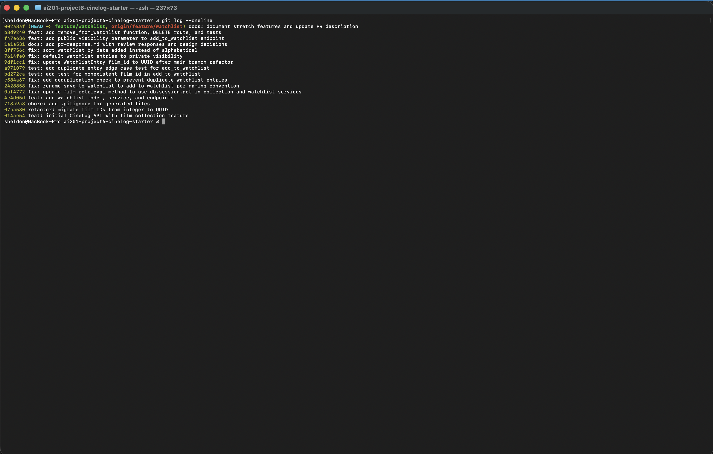

# PR Response Doc — CineLog Watchlist Feature

## AI Usage
I used Claude Code (Claude) throughout this project in a few distinct ways:

- **Orientation and setup:** Claude located the six review comments on the upstream PR (`jamjamgobambam/ai201-project6-cinelog-starter#1`, since my fork's PR wasn't the source — forking doesn't copy PRs) using the `gh` CLI, and read through `models.py`, `services/collection_service.py`, and `tests/test_collection.py` to identify the existing naming and deduplication conventions before touching any watchlist code.
- **Code changes (Comments 1, 2, 3, 6):** Claude implemented the rename, the deduplication check (mirroring `add_to_collection()`), the required and stretch tests, and the rebase conflict resolution, running `pytest tests/ -v` after each change to confirm nothing broke. I reviewed each diff before it was committed.
- **Devil's advocate on Comments 4 and 5 (design decisions):** Claude did not draft either argument. I wrote both positions myself — private-by-default visibility (grounded in the distinction between a watchlist's aspirational/unfinished data and a collection's completed-act data), and date-added sort order (agreeing with the reviewer but explaining why I rejected alphabetical). I then asked Claude what counterarguments a careful reviewer would raise. For Comment 4, it flagged that I was overclaiming when I called collections "inherently public" (the codebase actually has no visibility field on `CollectionEntry` at all — it's unrestricted by omission, not by a deliberate public default), and that the intent-vs-completed-action framing could be read in the opposite direction (wanting to watch something is more "live" than having watched it). For Comment 5, it flagged that my draft didn't address the "did I already add this film?" lookup case that alphabetical order is naturally good at. I revised both arguments myself in response to that feedback — the final reasoning and wording are mine, but sharper than my first draft because of that pushback.
- **Commit hygiene:** Before finalizing, I asked Claude to check that all commit messages followed conventional commit format (`feat:`/`fix:`/`test:`/`docs:`) and that no commit bundled multiple logical changes — this caught that my rebase had accidentally bundled the UUID type fix and the visibility-default change into a single commit, which I then split into two.

## Comment 1 — Rename
**What I did:** Renamed `save_to_watchlist()` to `add_to_watchlist()` in `services/watchlist_service.py` to match the project's `verb_to_noun` naming convention already used by `add_to_collection()` in `collection_service.py`. Updated the docstring's first line ("Save a film..." → "Add a film...") to match.

**How I verified:** Ran `grep -rn "save_to_watchlist" --include="*.py" .` across the whole repo before and after the change. Before: two hits outside the definition itself — the import and the call in `routes/watchlist/watchlist.py`. Both were updated (import statement and the `entry = add_to_watchlist(...)` call). After the change, the grep returned zero matches for the old name anywhere in the codebase. Also ran `pytest tests/ -v` — all 4 existing tests still pass, confirming the rename didn't break the collection tests or import wiring.

## Comment 2 — Deduplication
**What I did:** Mirrored `add_to_collection()`'s pattern exactly: before `add_to_watchlist()` creates a new `WatchlistEntry`, it now queries `WatchlistEntry.query.filter_by(user_id=user_id, film_id=film_id).first()`. If a matching row already exists, it raises a new `AlreadyOnWatchlistError` (defined analogously to `AlreadyInCollectionError` in `collection_service.py`) instead of silently inserting a duplicate row. I also updated `routes/watchlist/watchlist.py` to catch `AlreadyOnWatchlistError` and return a 409, and to catch `FilmNotFoundError` and return a 404 — matching how `routes/collection.py`'s `add_film` endpoint handles the equivalent errors from `add_to_collection()`. Without this, the watchlist route would previously let an unhandled exception surface as a generic 500.

**How I verified:** Read `add_to_collection()` in `services/collection_service.py` first to see the existing dedup check-then-raise pattern, and copied its shape (query by `user_id` + `film_id`, `.first()`, raise a dedicated exception with a descriptive message) rather than inventing a new approach. Manually exercised it with an in-memory SQLite app context: called `add_to_watchlist()` twice with the same `user_id`/`film_id` and confirmed the second call raises `AlreadyOnWatchlistError` rather than creating a second row. Also re-ran `pytest tests/ -v` to confirm the existing collection tests still pass (nothing in `watchlist_service.py` is imported by them, so this was a regression check, not new coverage — Comment 3 adds watchlist-specific tests).

## Comment 3 — Missing test
**What I did:** Created `tests/test_watchlist.py`, modeled directly on `tests/test_collection.py`. Reused the same `app`, `sample_user`, and `sample_film` fixture structure (in-memory SQLite, app-context-scoped, teardown via `db.session.remove()` / `db.drop_all()`). The required test, `test_add_to_watchlist_nonexistent_film_raises`, is a near-literal port of `test_add_to_collection_nonexistent_film_raises`: it calls `add_to_watchlist()` with a `film_id` that doesn't exist (`"00000000-0000-0000-0000-000000000000"`) and asserts `FilmNotFoundError` is raised via `pytest.raises`. I also added `test_add_to_watchlist_creates_entry` as a basic happy-path sanity check (modeled on `test_add_to_collection_creates_entry`) since it exercises the same fixtures the nonexistent-film test depends on.

**Stretch — second test:** I added `test_add_to_watchlist_duplicate_raises`, modeled on `test_add_to_collection_duplicate_raises`. It calls `add_to_watchlist()` twice with the same user/film and asserts the second call raises `AlreadyOnWatchlistError`, then queries the DB directly to confirm exactly one row exists (not two). I chose this edge case because it's the one most likely to regress silently — the dedup check added in Comment 2 is a single `if existing:` guard, and if a future refactor of the query (e.g. changing `filter_by` to something less precise) broke it, the failure mode would be a silent duplicate row rather than a loud error. A test that checks both "raises" and "count == 1" catches that class of bug directly, the same way the collection test suite already does for `add_to_collection()`.

**How I verified:** Ran `pytest tests/test_watchlist.py -v` after the required test to confirm it passed in isolation, then `pytest tests/ -v` after adding the stretch test to confirm all 7 tests (4 collection + 3 watchlist) pass together with no fixture collisions between the two files.

## Comment 4 — Default visibility
**My position:** Watchlist entries should default to `public=False`, not `public=True`.

**Reasoning:** The default should favor privacy, especially now, when AI-driven scraping is so pervasive that even a few data points can support sensitive inferences about a person. But for CineLog specifically, this isn't a generic surveillance claim — it comes from a real difference between the two features in this codebase. A collection entry represents "films I have already watched": a completed act, and today it's already treated as an unrestricted record (`CollectionEntry` has no visibility field at all). A watchlist entry represents "films I am curious about but haven't committed to." It's exploratory and aspirational, closer to search history than to a public log. That distinction matters because a watchlist can expose leading indicators of identity or interest before a user is ready to disclose them: political documentaries, health-related films, religious content, or LGBTQ+ films someone hasn't come out about. I'll acknowledge the other direction too: wanting to watch something is active, present-tense curiosity, while having watched something is past behavior — so a reviewer could argue the watchlist is actually the more "live" signal, not the less risky one. I don't think that makes it less worth protecting; if anything it means the watchlist is revealing a different, more current kind of information than the collection, which is exactly why it deserves its own default rather than inheriting the collection's.

**Tradeoff acknowledged:** A private default significantly reduces CineLog's social and discovery value for users who never touch their settings, which is most users — friends can't casually see what you're planning to watch. I think that cost is worth it here, because the harm of exposing unfinished, aspirational data is more intimate and less recoverable than the benefit of casual discovery. `WatchlistEntry` already has a `public` boolean per entry, so users who *want* the social value can opt in per-film; the change here is only which value that field starts at.

## Comment 5 — Sort order
**My position:** I agree with the reviewer — `get_watchlist()` should default to date-added (most recent first), not alphabetical.

**Reasoning:** A watchlist is exploratory and short-lived, not a curated reference list you browse alphabetically like a dictionary. Users open a watchlist to quickly see what they're currently curious about — recent additions, upcoming releases, thematic clusters — not to locate a specific title the way you'd look up a word. Chronological order, newest first, matches that forward-looking, "what's on my mind right now" use of the feature, and it's also consistent with how `get_collection()` already sorts (`date_added.desc()`), so the two features behave the same way instead of diverging for no real reason.

**Engagement with reviewer's point:** The reviewer's claim — "most users want to see what they added recently" — is the strongest argument here and I'm not disputing it. The one gap in defaulting to date-added is the "did I already add this film?" lookup case, which alphabetical order is naturally good at once a list gets long. But I don't think that's actually the sort order's job to solve — that's a search/filter problem, and losing alphabetical-by-default doesn't take that capability away, it just means it should be a separate filter rather than the default view. Given that, I'd rather optimize the default for the common case (what did I just add) than for a lookup case that a proper search feature would handle better anyway.

## Comment 6 — Rebase
**What conflicted:** While this PR was open, `main` merged a refactor (`07ca580 refactor: migrate film IDs from integer to UUID`) that changed `Film.id` from `db.Integer` to `db.String(36)` and updated `CollectionEntry.film_id` to match. That refactor also removed `WatchlistEntry` entirely from `models.py` on `main`, since the watchlist feature only exists on this branch. Running `git fetch origin && git rebase origin/main` produced two conflicts: a trivial add/add conflict on `.gitignore` (both branches independently added one), and a real content conflict in `models.py` — my branch was re-adding the `WatchlistEntry` class (with `film_id` still typed as `db.Integer`, referencing the pre-refactor `Film.id`) on top of a version of the file that no longer had that class at all.

**How I resolved it:** For `.gitignore`, I kept the union of both versions (mine added `.venv/`/`venv/`, main's added `.pytest_cache/`) — no real disagreement, just two branches adding the same file. For `models.py`, I kept the `WatchlistEntry` class but changed `film_id = db.Column(db.Integer, ...)` to `film_id = db.Column(db.String(36), db.ForeignKey("film.id"), nullable=False)`, matching the type `CollectionEntry.film_id` already uses post-refactor. I also updated stale docstrings/comments in `services/watchlist_service.py` and `routes/watchlist/watchlist.py` that still described `film_id` as an integer, and split the fix into its own commit (`fix: update WatchlistEntry film_id to UUID after main branch refactor`) separate from the visibility-default and sort-order commits, so the UUID fix isn't bundled with unrelated design decisions.

**How I verified no conflict remains:** After `git rebase --continue` completed, I ran `git log --oneline --merges origin/main..HEAD`, which returned nothing — confirming a linear history with no merge commits. I also grepped the watchlist code (`grep -rn "integer\|Integer" services/watchlist_service.py routes/watchlist/watchlist.py`) to confirm no other stale integer references remained outside of unrelated fields like `Film.year` and `CollectionEntry.rating`, which are legitimately integers. Finally, I ran `pytest tests/ -v` — all 7 tests (4 collection + 3 watchlist) passed after the rebase, confirming the UUID type change didn't break the watchlist test fixtures, which create `Film` rows and rely on SQLAlchemy generating a UUID `id` via `default=generate_uuid`.

## Commit History

Final `feature/watchlist` history after rebasing onto `main`: 13 commits ahead of `main`, all in conventional format, no merge commits — linear history confirmed by `git log --oneline --merges origin/main..HEAD` returning nothing.

## Stretch Features

**`remove_from_watchlist()`:** Added in `services/watchlist_service.py`, following the same pattern as `remove_from_collection()`: it looks up the `WatchlistEntry` by `user_id` + `film_id`, and if none exists it raises a new `NotOnWatchlistError` instead of silently no-op'ing — mirroring `NotInCollectionError`. Exposed via `DELETE /watchlist/<user_id>/remove` (body: `{"film_id": "<uuid>"}`), which catches `NotOnWatchlistError` and returns a 404, matching `routes/collection.py`'s `remove_film` endpoint. Two tests cover it: `test_remove_from_watchlist_deletes_entry` (happy path — confirms the row is actually gone from the DB after removal, not just that no exception was raised) and `test_remove_from_watchlist_not_present_raises` (removing a film never added to the watchlist raises `NotOnWatchlistError`).

**Visibility toggle endpoint:** `add_to_watchlist()` now accepts an optional `public` keyword argument. When omitted (`None`), the `WatchlistEntry` uses the model's column default (private, per Comment 4). When provided, it overrides the default on that entry (`entry.public = public`) before the row is inserted. The `POST /watchlist/<user_id>/add` endpoint passes `data.get("public")` through, so a caller can explicitly opt an entry into `public: true` at creation time without needing a second call, while still getting private-by-default if they omit the field entirely. Verified manually with an in-memory app context: calling `add_to_watchlist()` with no `public` argument produced `entry.public == False`, and calling it with `public=True` produced `entry.public == True`.

## PR Description
<!-- Written at the end — feature overview, design decisions, manual testing steps -->

### Summary

Adds a watchlist feature to CineLog so users can save films they want to watch, separate from their collection of films they've already watched. Includes a `WatchlistEntry` model, `add_to_watchlist()` / `get_watchlist()` / `remove_from_watchlist()` service functions, and `GET /watchlist/<user_id>`, `POST /watchlist/<user_id>/add`, and `DELETE /watchlist/<user_id>/remove` endpoints. This PR also addresses all six review comments from the initial submission:

- Renamed `save_to_watchlist()` → `add_to_watchlist()` to match the project's `verb_to_noun` naming convention.
- Added deduplication so adding the same film twice raises `AlreadyOnWatchlistError` (409) instead of creating a duplicate row, mirroring `add_to_collection()`.
- Added `tests/test_watchlist.py` covering entry creation, duplicate rejection, a nonexistent `film_id` (`FilmNotFoundError`, 404), and removal (both happy path and the not-present case).
- Rebased onto `main` to pick up the integer → UUID film ID refactor, updating `WatchlistEntry.film_id` to `db.String(36)`.

Stretch additions: `remove_from_watchlist()` (with tests), and an optional `public` parameter on the add endpoint so callers can override the default visibility per entry. See "Stretch Features" above for details.

### Design decisions

- **Default visibility:** `WatchlistEntry.public` now defaults to `False` (previously `True`). A watchlist represents unfinished, aspirational intent rather than a completed act like a collection entry, and can expose sensitive interests before a user chooses to share them. Users can still opt individual entries into `public=True`. See Comment 4 above for the full reasoning and acknowledged tradeoff (reduced casual social discovery for users who never touch settings).
- **Sort order:** `get_watchlist()` now sorts by `date_added` descending (most recent first) instead of alphabetically by title, consistent with `get_collection()`. A watchlist is used to check "what am I currently curious about," not to look up a specific title by name — see Comment 5 for the full argument, including why the alphabetical lookup case doesn't need to be the default sort's job.

### Manual testing steps

1. `source .venv/bin/activate && python app.py` to start the server on `http://127.0.0.1:5000`.
2. Create a user and a film via the existing endpoints (or seed them directly), noting their UUIDs.
3. `POST /watchlist/<user_id>/add` with body `{"film_id": "<film-uuid>"}` — expect `201` and a JSON entry with `"public": false`.
4. Repeat the same `POST` — expect `409` with an `AlreadyOnWatchlistError` message, and confirm via `GET /watchlist/<user_id>` that only one entry exists.
5. `POST /watchlist/<user_id>/add` with a nonexistent `film_id` (e.g. `"00000000-0000-0000-0000-000000000000"`) — expect `404`.
6. `POST /watchlist/<user_id>/add` for a second film with body `{"film_id": "<film-uuid>", "public": true}` — expect `201` with `"public": true`, confirming the visibility toggle overrides the private default.
7. Add a third film a few seconds after the others and `GET /watchlist/<user_id>` — confirm the response is ordered most-recently-added first, not alphabetically.
8. `DELETE /watchlist/<user_id>/remove` with body `{"film_id": "<film-uuid>"}` for one of the films added above — expect `200`, then confirm via `GET /watchlist/<user_id>` that it's gone.
9. Repeat the same `DELETE` for the same film — expect `404` with a `NotOnWatchlistError` message, confirming it doesn't silently succeed twice.
10. `pytest tests/ -v` — all tests should pass (9 total: 4 collection, 5 watchlist).
